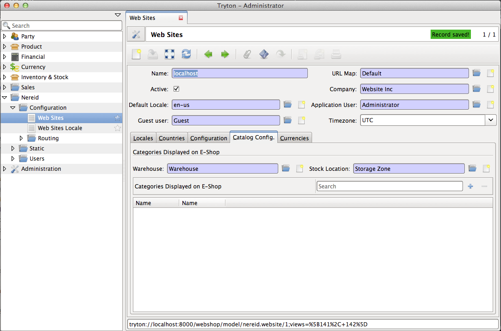

nereid-webshop
==============

Full Webshop based on Tryton Nereid


Installation
------------

Setting this module up is similar to the setup of any other tryton module.


Step 1: Create a virtualenv
```````````````````````````

::

  virtualenv webshop
  
You can now activate the virtualenv 

::

  cd webshop
  source bin/activate


Step 2: Clone and Setup the module
```````````````````````````````````
::

  git clone git@github.com:openlabs/nereid-webshop.git
  cd nereid-webshop
  python setup.py install
  

This command would install all the required dependencies for the module to
function.

Step 3: Setup Database
```````````````````````

The module should now be available on the modules list and can be
installed into any database. Setup a website as shown below:




You will have to create a guest user for nereid. The guest user would be
the user which would be available in the context when there are no users
logged into the website.

Ensure that you have the following too:

  * A pricelist
  * A payment_term

Step 4: Create an application script
````````````````````````````````````

Create an `application.py` script which could lauch the application. A
reference is provided in the web folder (`application-example.py
<web/application-example.py>`_).

In most cases the only changes you may need are:

* the DATABASE_NAME which should be the name of the database (from step 3).
* the TRYTON_CONFIG which should be the location of the tryton config
  file.

You should now be able to run the development server by running the
application using::

  python application.py

On pointing the browser to `localhost:5000 <http://localhost:5000/>`_ you
should be able to see the home page.

.. image:: doc/homepage.png

Step 5: Production Deployment
`````````````````````````````

TODO
